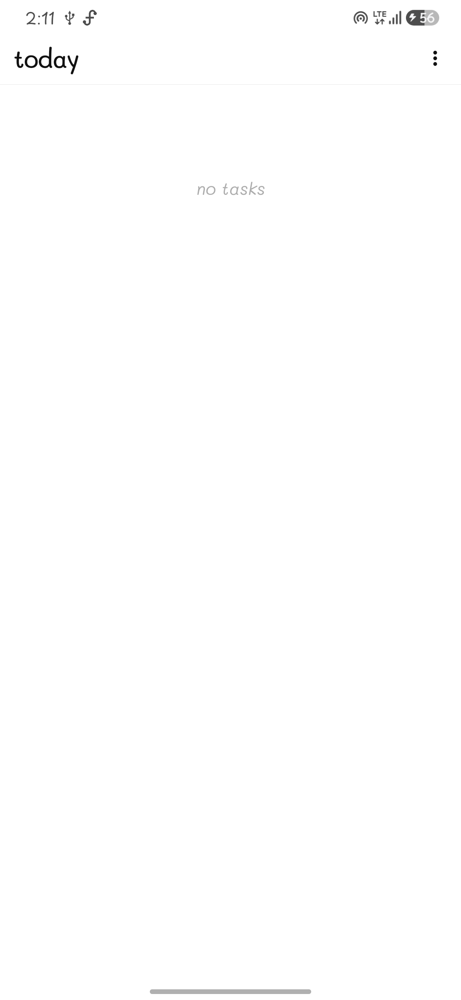
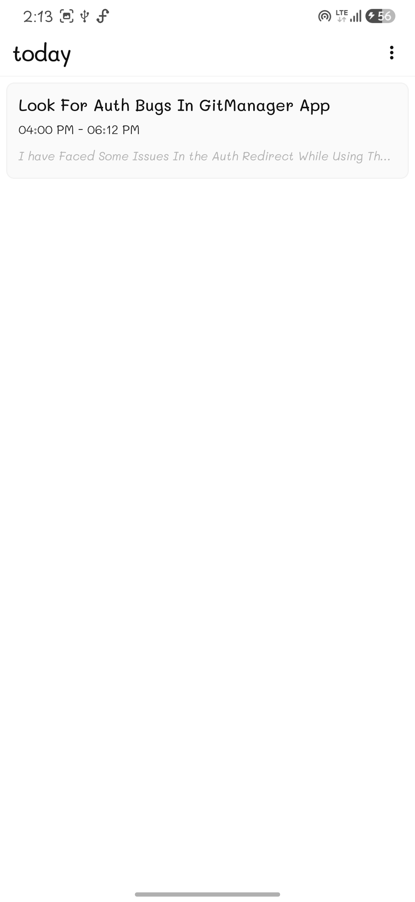
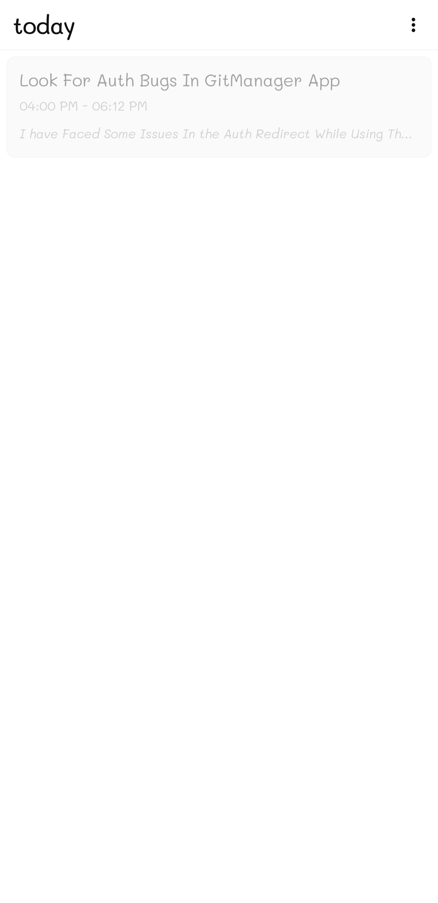
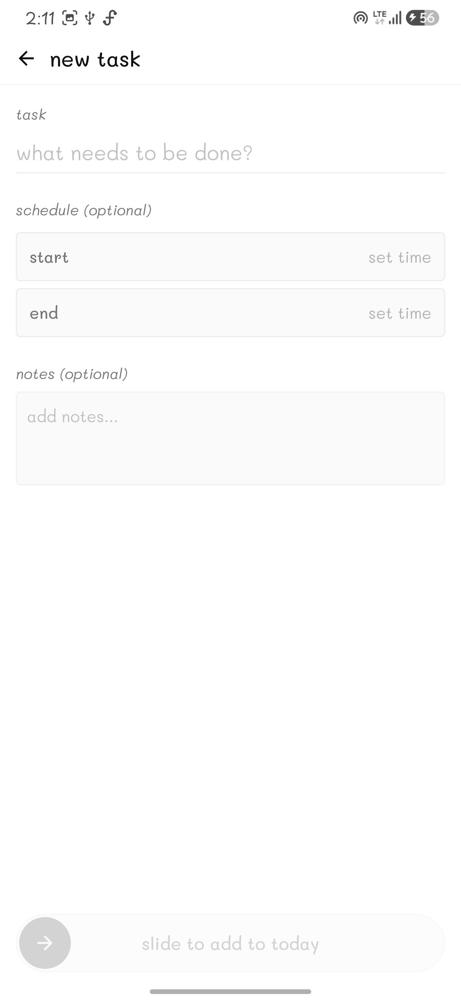
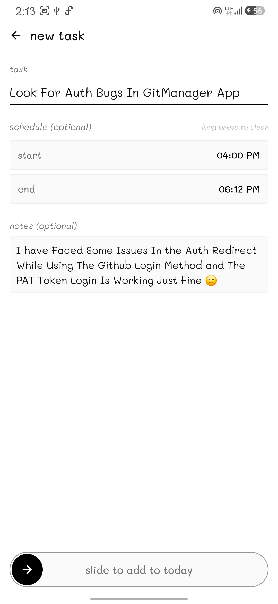
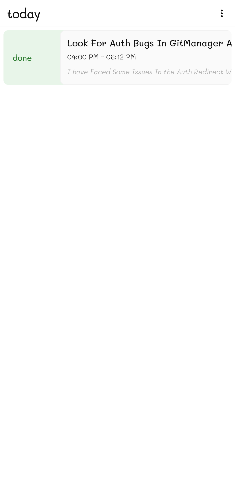
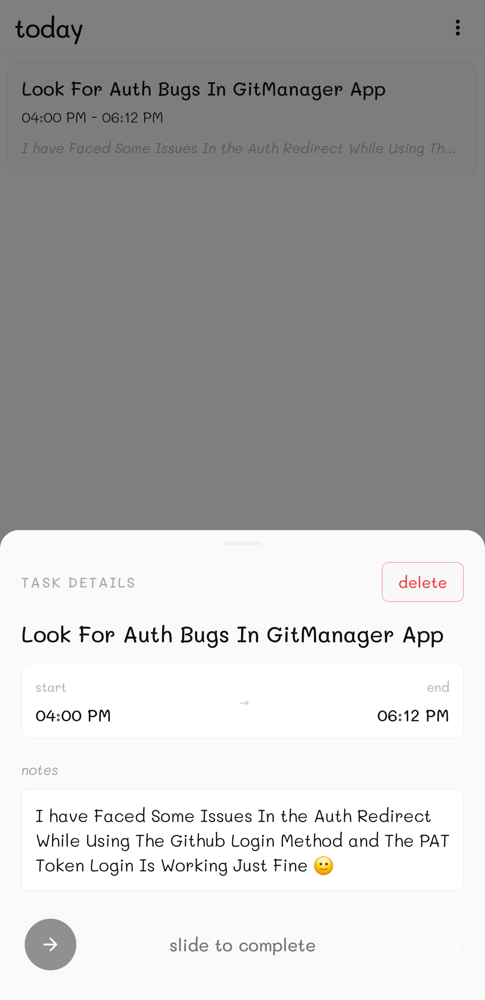
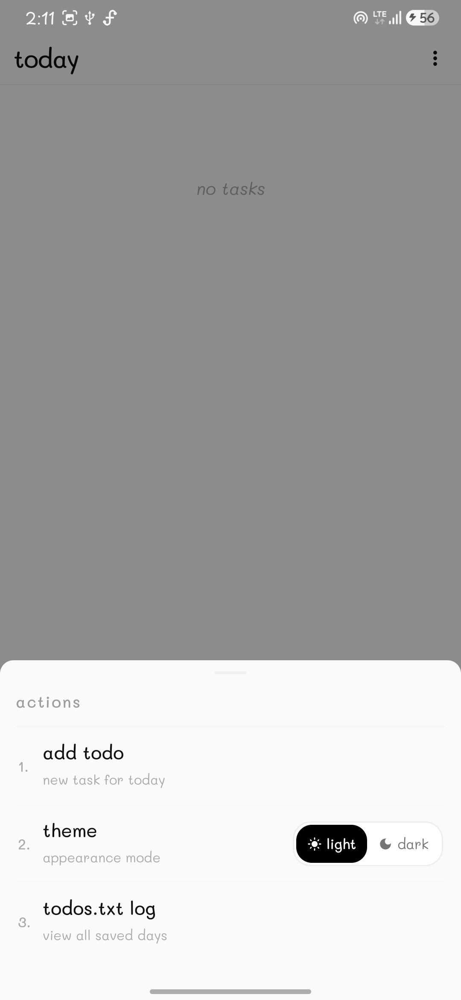

# Today 📅

<div align="center">

[](https://android.com)
[](https://kotlinlang.org)
[](https://developer.android.com/jetpack/compose)
[](https://m3.material.io)
[](LICENSE)
[](https://github.com/apandey-dev/Today/actions/workflows/build-apk.yml)

**An ultra-minimalist, distraction-free daily task planner for Android.**  
*Dynamic calendar launcher icon • Live minimalist widget • Plain-text persistence • Zero fluff.*

</div>

---

## 📱 Visual Walkthrough & Screenshots

### 1. Daily Task Management
<div align="center">
  
  
  
  <p><em>Empty State • Active Daily Tasks • Completed Tasks with Clean Dimming</em></p>
</div>

### 2. Creating & Scheduling Tasks
<div align="center">
  
  
  <p><em>Minimal Input Screen • Start & End Time Picker with Notes & Slide-to-Add</em></p>
</div>

### 3. Gestures & Action Sheets
<div align="center">
  
  
  
  <p><em>Quick Swipe Action • Task Details & Slide-to-Complete • Actions Menu with Theme Switcher</em></p>
</div>

---

## ✨ Features

- **🗓️ Dynamic Launcher Icon (Days 1–31)**: The app icon on your home screen automatically switches every day to match the current day of the month without restarting your device.
- **🔲 Minimalist 1:1 Home Screen Widget**: Clean live widget displaying the current date, completed tasks count (`done`), and pending tasks count (`undone`).
- **📝 Easy-to-Read Plain Text Storage (`todos.txt`)**: All your tasks are stored locally in a simple, human-readable text format—no complex or hidden databases. Anyone can open, read, and understand the log at a glance:
  - **Dates**: Separated clearly by date headers (e.g. `=== 2026-09-28 ===`)
  - **Checkboxes**: `[x]` for completed tasks, `[ ]` for pending tasks
  - **Timing & Notes**: Optional schedules (`09:00 AM - 11:30 AM - Task Name`) and attached notes (`> Note text`)
  - **Built-in Log Viewer**: In-app viewer with one-tap clipboard export.
- **⚡ Fluid Gestures & Haptics**:
  - **Swipe Right**: Mark task as `done` with satisfying haptic feedback.
  - **Swipe Left**: Mark task as `undone`.
  - **Long Press**: Open detailed task bottom sheet with notes, schedule timings, and deletion.
  - **Slide-to-Confirm Buttons**: Smooth iOS-style slide actions for task creation and status toggles.
- **🎨 Theme Customization**: Seamless switching between high-contrast OLED Dark Mode and paper-clean Light Mode with custom segmented controls.
- **✍️ Custom Typography**: Styled with the beautiful and playful `Mali` handwriting font family.
- **🔒 100% Offline & Private**: Zero internet permissions required, zero background telemetry, zero tracking, and zero ads.

---

## 🏗️ Architecture & Tech Stack

- **Language**: Kotlin 2.0+
- **UI Toolkit**: Jetpack Compose with Material 3
- **Design System**: Custom handwritten typography (`Mali-Regular`, `Mali-Medium`, `Mali-Italic`) & bespoke minimalist palettes
- **Widgets**: `AppWidgetProvider` with custom vector/canvas rendering
- **Storage**: Local persistence with mirrored `todos.txt` formatting
- **Target SDK**: Android 15 (API 35)
- **Minimum SDK**: Android 7.0 (API 24)

---

## 📂 Project Structure

```
Today/
├── .github/workflows/
│   └── build-apk.yml              # Automated GitHub Actions CI workflow to build APKs
├── app/
│   ├── src/main/
│   │   ├── java/com/minimal/today/
│   │   │   ├── data/             # TodoRepository & file I/O
│   │   │   ├── model/            # TodoItem data models
│   │   │   ├── receiver/         # DateChangeReceiver for automatic midnight icon update
│   │   │   ├── ui/
│   │   │   │   ├── screens/      # TodayScreen, AddTodoScreen, LogViewScreen
│   │   │   │   └── theme/        # Color, Theme, and Typography definitions
│   │   │   ├── util/             # IconHelper for dynamic activity-aliases
│   │   │   ├── widget/           # TodayWidgetProvider & WidgetHelper
│   │   │   └── MainActivity.kt   # App root & navigation container
│   │   ├── res/                  # Drawable assets, fonts, layouts, and day 1-31 adaptive icons
│   │   └── AndroidManifest.xml   # Manifest with 31 dynamic launcher activity-aliases
│   └── build.gradle.kts          # Module-level Gradle configuration
├── fonts/                        # Original Mali TrueType font files
├── build.gradle.kts              # Root build script
├── settings.gradle.kts           # Gradle settings and plugin management
└── README.md
```

---

## 🚀 Building & Running from Source

### Prerequisites
- [Android Studio Ladybug (or newer)](https://developer.android.com/studio)
- JDK 17
- Android SDK with Platform 35

### Clone & Build
```bash
# 1. Clone repository
git clone https://github.com/apandey-dev/Today.git
cd Today

# 2. Build Debug APK using Gradle wrapper
# On Windows:
.\gradlew.bat assembleDebug

# On macOS / Linux:
chmod +x gradlew
./gradlew assembleDebug
```

The generated APK will be available at:
```
app/build/outputs/apk/debug/app-debug.apk
```

---

## 📦 Releases & Installation

You can download the pre-compiled APK directly from the [Releases](https://github.com/apandey-dev/Today/releases) tab.

1. Download `app-debug.apk` onto your Android device.
2. Open the file and follow the on-screen prompt to install (enable *"Install from Unknown Sources"* if prompted).
3. Add the **Today** widget to your home screen for quick daily overview.

---

## 📄 License

This project is open-source software licensed under the [MIT License](LICENSE).
